

# Southville Sporting Club | Full Stack Website

## Bristol Based Vintage Athletic Wear

This website has been created to sell UK created athletic wear, it is based on a small UK concept business. 

[![VisitWebsite][website-shield]][website-url]&nbsp;&nbsp;
[![Issues][issues-shield]][issues-url]&nbsp;&nbsp;
[![ClosedIssues][closed-shield]][closed-url]&nbsp;&nbsp;
[![LinkedIn][linkedin-shield]][linkedin-url]
 

## Table of Contents

1. [User Experience](#user-experience)
2. [Design](#design)
3. [Features](#features)
4. [Testing](#testing)
5. [Accessibility](#accessibility)
6. [Technologies Used](#technologies-used)
7. [Deployment and Local Development](#deployment-and-local-development)
8. [Credits](#credits)
---
# User Experience

1. [Goals](#goals)
2. [Visual Design](#visual-design)

## Goals

1. [Business Goals](#business-goals)
2. [User Goals](#user-goals)
3. [User Story](#user-story)
4. [Strategy](#strategy)

### Business Goals
------
This website performs a twofold mission, finely honed to achieve tangible results: firstly, by meticulously crafting an effortlessly navigable e-commerce platform that seamlessly converts visitors into loyal customers. The user-friendly online store is fortified with secure transactions and showcases the captivating 'Run with Nature' collection - a harmonious blend of vintage athletics and natural elements that guarantees an immersive and satisfying shopping experience, ultimately translating clicks into sales. Secondly, the ambition is to cement an unmistakable identity as the icon of vintage athletic wear intertwined with nature's allure, forging an enduring connection with Bristol's scenic landscapes. 
Mission Statement: "Southville Sporting Club's mission is to unite vintage athletics, nature's beauty, and seamless e-commerce, crafting an active, nostalgic, and environmentally attuned lifestyle."

### User Goals
------
Prospective users of this website seek a seamless and enjoyable online shopping experience where they can explore and purchase the captivating 'Run with Nature' collection. They aim to find high-quality vintage athletic wear that reflects their active lifestyle and appreciation for eco-friendly materials, all while connecting with the vibrant spirit of Bristol's scenic landscapes. Additionally, users intend to make secure and hassle-free transactions, converting their interest into a satisfying shopping journey.

### User Stories 

| AS A/AN | I WANT TO BE ABLE TO… | SO I CAN… |
| --------------- | --------------- | --------------- |
| Viewing and Navigation |
| Shopper | View a list of items | See if any interest me to purchase |
| Shopper  | View product details | View further information such as images, descriptions, prices, and availability.
| Shopper | View the homepage  | See featured products and promotions |
| Registration/Accounts |
| Shopper | Register for an account | Track my purchases |
| Site User | Log in to my account securely | Access my profile and saved information |
| Site User | Reset my password | Recover access to my account |
| Site User | Login through social media | Easily login and set up an account |
| Site User | Update profile information | Ensure items are received and payments are correct |
| Sorting and Searching |
| Shopper | Filter products | View products by various criteria such as popularity, price, and newest arrivals |
| Shopper | Refine my search | Find specific items based on color or size |
| Shopper | Search for specific products using keywords | Quickly find what I'm looking for |
| Purchase and Checkout |
| Shopper | Add items to my shopping cart | Keep for a later purchase |
| Shopper | View my cart | See a summary of selected items and their quantities |
| Shopper | Update quantities or remove items | Purchase the goods I want |
| Shopper | Apply coupon codes | Save money on my order |
| Shopper | Choose from different payment options | Easily pay for my order |
| Shopper | Review order summary | Ensure the order is correct |
| Shopper | Receive a confirmation email | Confirm order details are correct and ensure the order was processed |
| Site Owner |
| Site Owner | Manage and process orders | Send items to customers |
| Site Owner | Add and remove items from the site |  Show customers items that are in stock |

### Strategy
------
The primary target audience for Southville Sporting Club is individuals aged 20-40 who seek stylish and sustainable unisex clothing that resonates with the spirit of vintage athletics and nature's beauty.

What the users would be looking for:
* Effortless Navigation: Users expect a user-friendly and intuitive interface that allows them to easily explore the website and find products.
* Account Creation: Users should be able to create a personal account for a customised shopping experience, including saving preferences and order history.
* Product Information: Comprehensive product descriptions, high-quality images, and sizing information to help users make informed choices.
* Security: Users want to feel confident that their personal and financial information is secure when making purchases.
* Sustainability Information: Details about the use of eco-friendly materials, reinforcing the brand's commitment to sustainability.
* Contact and Support: Access to customer support or contact information for inquiries and assistance.

[Back to top](#table-of-contents)

## Design

1. [Fonts](#fonts)
2. [Styling](#styling)
3. [Wireframes](#wireframes)
4. [Database Schema](#database-schema)
5. [Surface](#surface)
6. [Coolors](#coolors)

### Fonts 
------
I used Google fonts 'Helvetica' and 'Times New Roman'. I used the Times New Roman font to make the header text on the index page stand out from the regular font on the site. I then used 'Helvetica' as I thought it was very easy to read and looks professional.

### Styling 
------
* Materialize CSS files have been incorporated into the project to leverage its pre-defined class defaults and components.
* The class defaults of Materialize CSS have been overridden to align with the desired styling preferences.
* Customisation has been made easier by modifying the source files directly, allowing for a consistent and unified design.
* The website incorporates responsive web design, allowing the site to adjust dynamically based on the screen size.
* Links present on each page have been intelligently designed to redirect users to essential sections, such as the Client or the Register page, irrespective of their current location.

### Wireframes
------

Index

Desktop

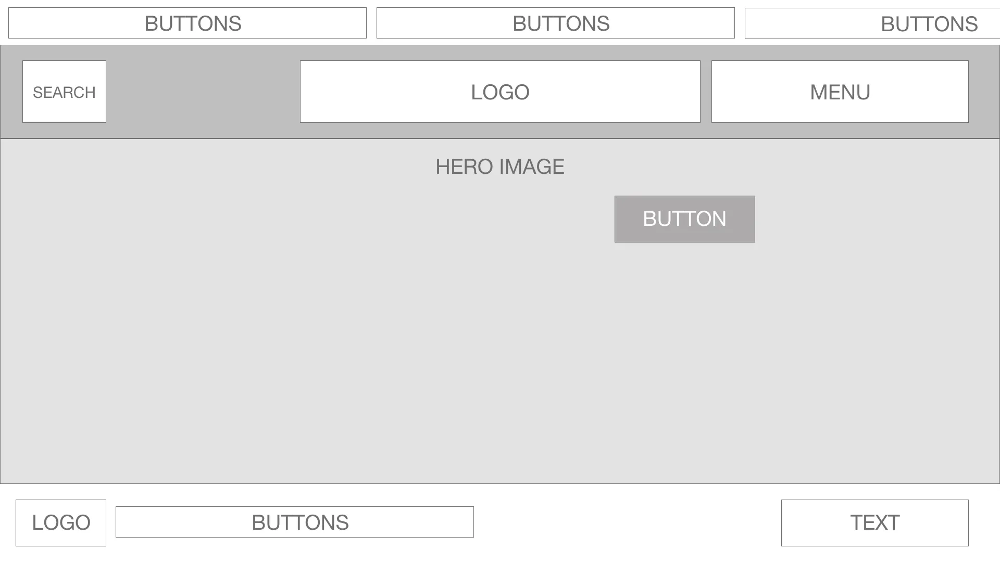
<!-- for when you're on AWS!! (static/images/readme/wireframes/index-desktop.webp) -->

Mobile

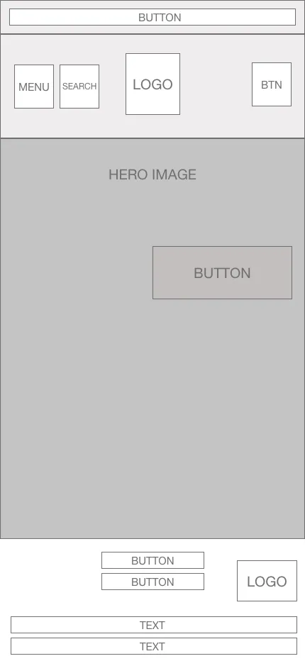

 

Products

Desktop

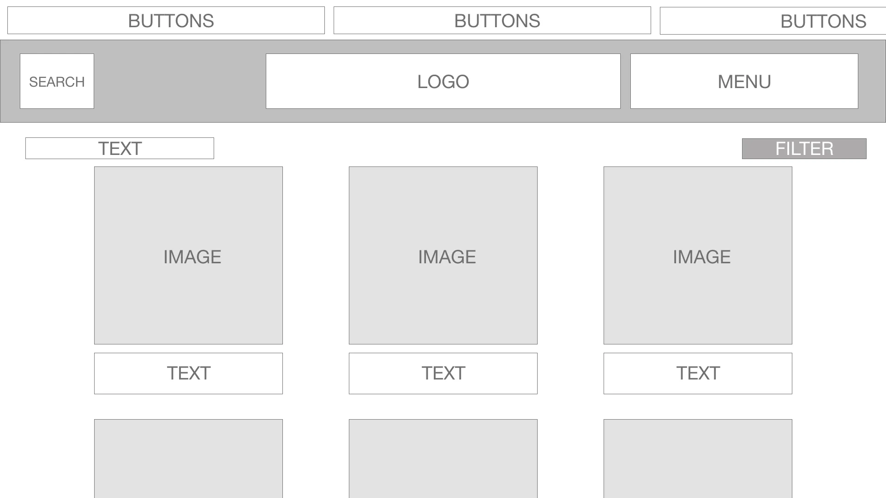
<!-- for when you're on AWS!! (static/images/readme/wireframes/index-desktop.webp) -->

Mobile

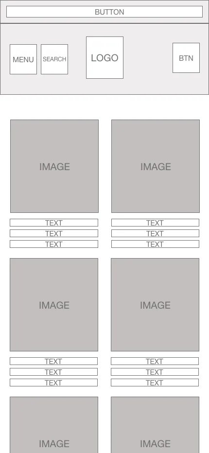

 

Product Detail

Desktop

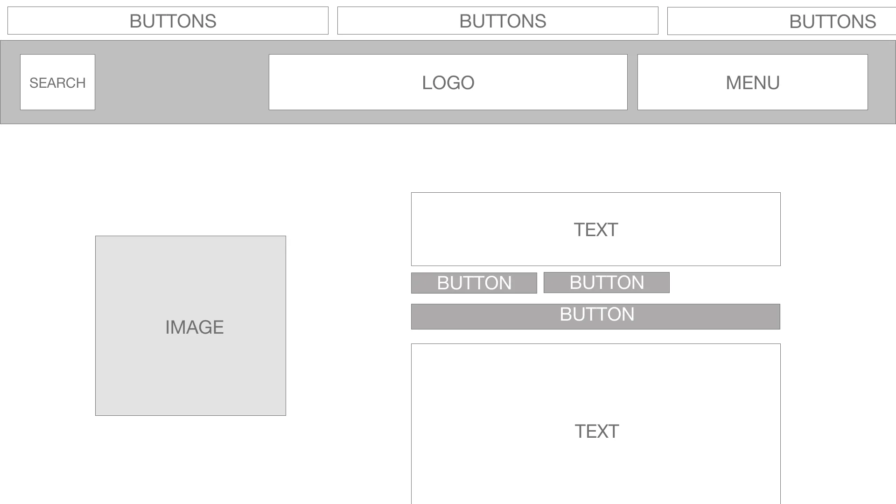
<!-- for when you're on AWS!! (static/images/readme/wireframes/index-desktop.webp) -->

Mobile

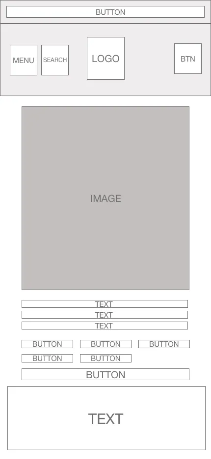

 

Bag

Desktop

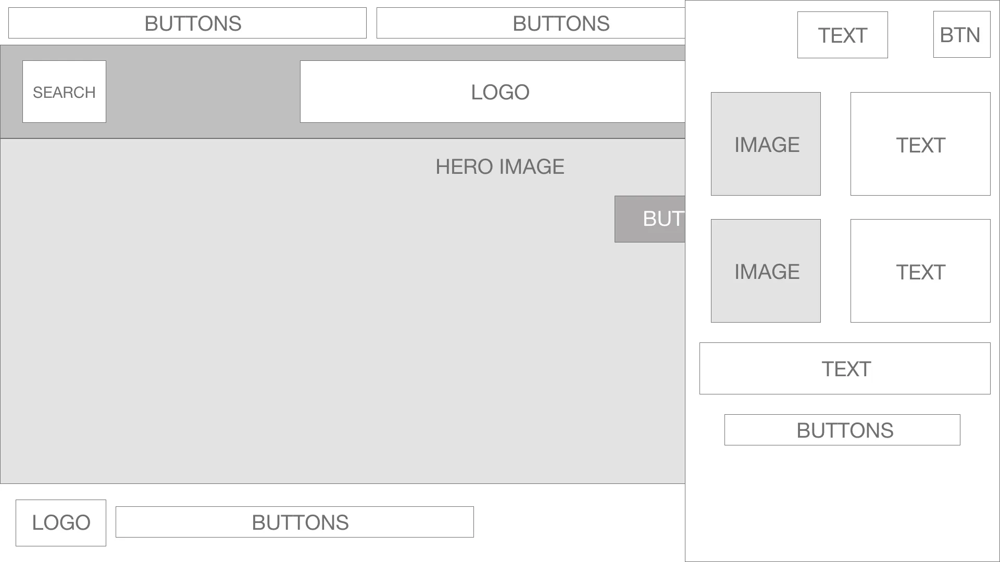
<!-- for when you're on AWS!! (static/images/readme/wireframes/index-desktop.webp) -->

Mobile

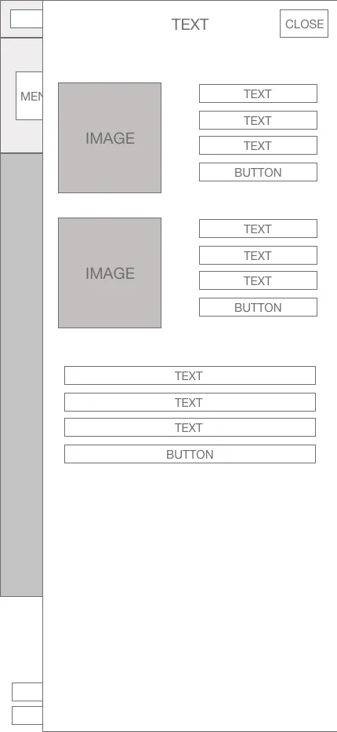

 

Checkout

Desktop

<!-- for when you're on AWS!! (static/images/readme/wireframes/index-desktop.webp) -->

Mobile

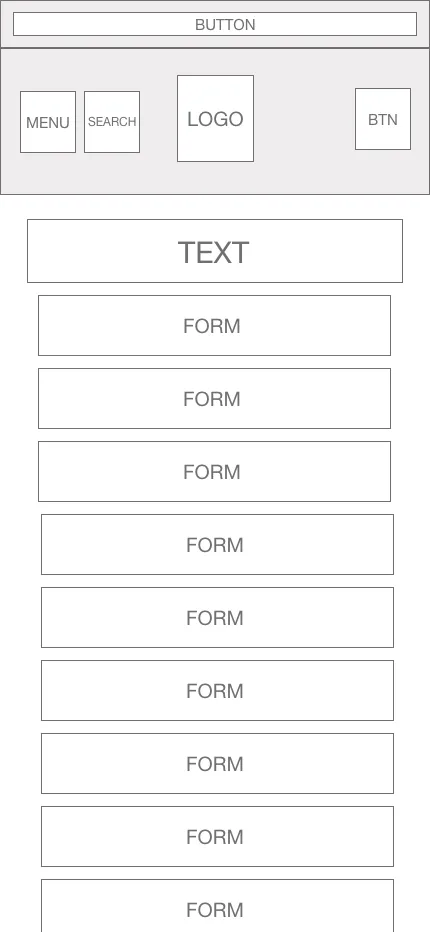

 

Profile

Desktop

<!-- for when you're on AWS!! (static/images/readme/wireframes/index-desktop.webp) -->

Mobile

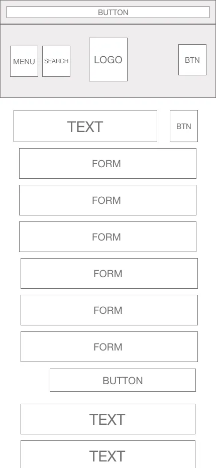

 

Contact

Desktop

<!-- for when you're on AWS!! (static/images/readme/wireframes/index-desktop.webp) -->

Mobile

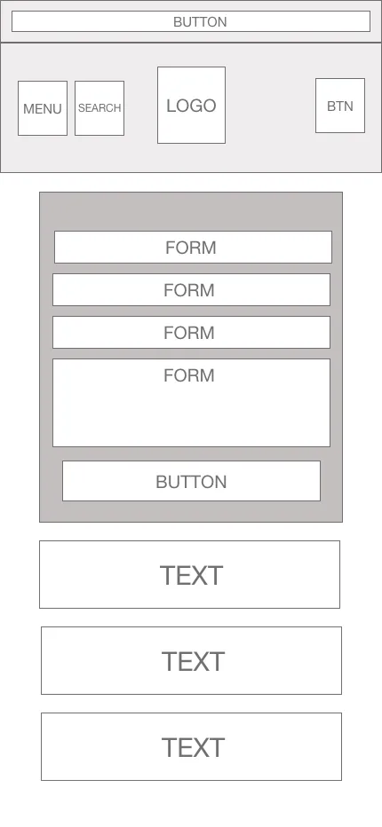

 

Admin Dashboard

Desktop

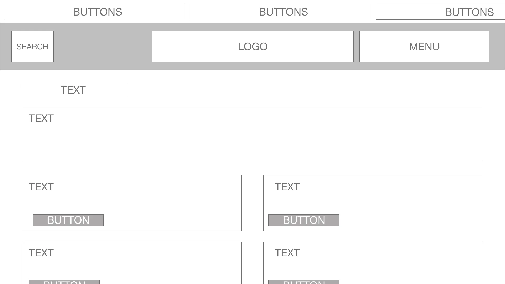
<!-- for when you're on AWS!! (static/images/readme/wireframes/index-desktop.webp) -->

Mobile

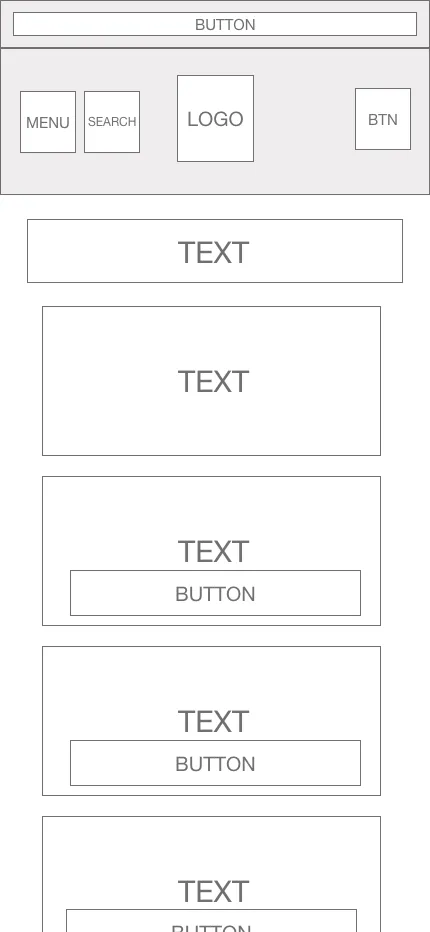

 

Shipping & Terms

Desktop

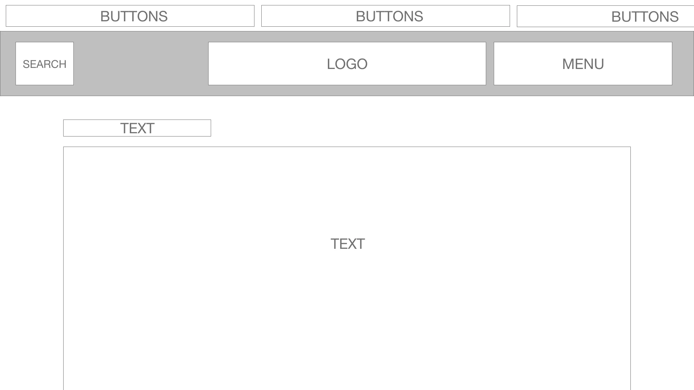
<!-- for when you're on AWS!! (static/images/readme/wireframes/index-desktop.webp) -->

Mobile

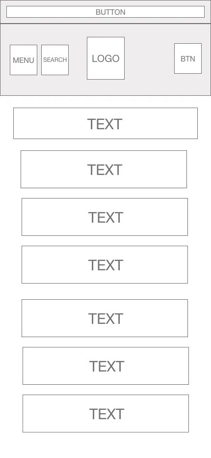

 

### Database Schema
------
This map represents the current models in the relational database, a few of the databases been modified or are completely new. Note the green items are new database models added.

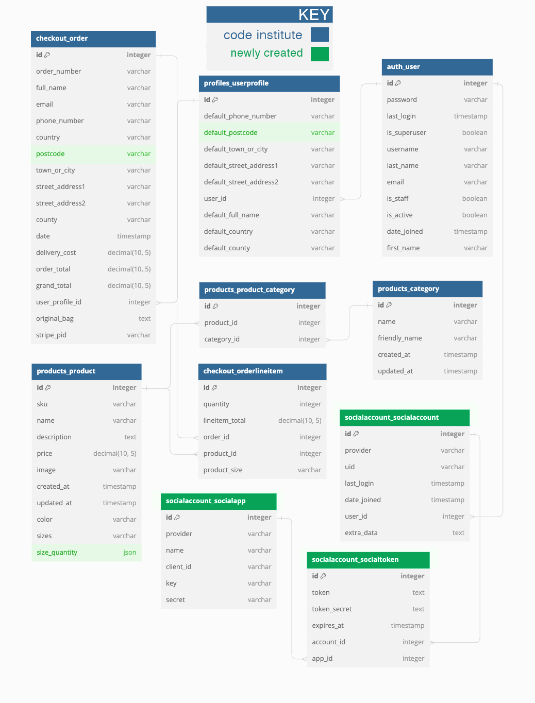

### Surface
------

The color palette for the website is derived from the hero image. Using Photoshop, colors were extracted directly from the image, resulting in the shades noted below. 

These colors, including black and white for a clean, minimalistic appearance, were carefully selected to mirror the image's essence, offering a contemporary and visually striking aesthetic.

### Coolors
------
Using the coolors palette on the image I selected the colours from this along with a darker and lighter shade of contrasting colours to create a balanced palette. 

[Back to top](#table-of-contents)

# Features

This is a fully responsive website that was designed mobile-first as this is the most likely way it will be viewed; the website is divided into the 22 pages, along with a base template using allauth and toasts for extra functionality. The profile pages are not available until the user is logged into the website. There is also a 404 page for when someone ends up on an incorrect page.

- [Home](#home)
- [Navbar & Footer](#navbar-footer)
- [About Us](#about-us)
- [Contact Us](#contact-us)
- [Error](#error)
- [Shipping & Returns](#shipping-and-returns)
- [Sustainability](#sustainability)
- [Terms & Conditions](#terms-and-conditions)

- [Products](#products)
- [Product Detail](#product-detail)
- [Search & Nothing Found](#search-and-nothing-found)

- [Shopping Bag Overlay](#bag-overlay)
- [Checkout](#checkout)
- [Checkout Success](#checkout-success)

- [Admin Dashboard](#admin-dashboard)
- [Stock List](#stock-list)
- [Order List](#order-list)
- [Add Product](#add-product)
- [Edit Product](#edit-product)

- [Profile](#profile)
- [Register](#register)
- [Login](#login)

### Home

The index page has:

A "Shop Now" button, which takes the user to the "Latest Drop" page of the newest products. 

View Here

 
   

### Navbar Footer

The navbar has the following features:

A logo that when clicked takes the user back to the index page.

A search function

A drop-down menu for the user account. Which only shows 'log in' and 'register' if the user is not logged in, but shows 'Admin Dashboard', 'Profile' and 'logout'.

Drop down menus (on desktop) for the info and shopping buttons to see further information such as categories. 

A burger style navbar for mobile users with the same button functionality. 

The footer has the following features:

Buttons links to the Terms & Conditions, Shipping & Returns and Contact pages. 

Icons for payment types accepted and other standard company information. 

NavBar Desktop

 

NavBar Mobile

 

Footer

 

### About Us

The about us page has the following features:

A hero image with a about us title and capturing caption to catch the users eye. 

Futher information about the brand and where the store is located. 

About Us Part 1

 

About Us Part 2

 

### Contact Us

The contact us page has the following features:

A user-friendly form has been integrated with Postmark, allowing users to submit inquiries directly through the platform.

Information about the location and opening times of the store is also available on the contact us page.

View Here

 

### Error

The error page has the following features:

A message notifying the user that they have found themselves on a page that doesn't exist. 

A button to return the user to the homepage. 

View Here

 

### Shipping & Returns

The shipping page has the following features:

A text based page to inform the user on the shipping and returns policy.  

View Here

 

### Sustainability

The sustainability page has the following features:

A hero looping video with a title and capturing caption to catch the users eye. 

Futher information about the sustainability and mission of the brand.  

Sustainability Part 1

 

Sustainability Part 2

 

[Back to top](#table-of-contents)

### Terms & Conditions

The terms page has the following features:

A text based page to inform the user on the shipping and returns policy.

A button at the end of the text to send the user to the contact form if they have further questions. 

View Here

 

### Products

The products page has the following features:

A list of products, which, when clicked, takes the user to the detail page of that specific product.

If the user is a superuser, at the bottom of each product are links to either edit or delete the product.

Text which lets the user know how many products there are in the category they are browsing. This also shows a link to "All Products".

A dropdown box with the ability to sort by price (low to high), price (high to low), name (a-z) and name (z-a). 

A scroll-up button on the bottom-right-hand-side of the page, which when clicked, will automatically scroll the page up to the top. This is available on all pages that are more than 100vh. 

View Here

 

Scroll Button

 

### Product Detail

The product details page has the following features:

If the user is a superuser, two links appear giving the user the ability to edit or delete the product.

The available sizes are button on the page for the user to choose form. If there is only one size then this is selected by default, and not changeable by the user. 

A button that will add the desired size of the product to the user’s checkout cart.

Three cards with a description, shipping returns and size guide for user to read if needed. The shipping section has a button to view the full shipping page. The description is opened on default. 

View Here

 

### Search & Nothing Found

The nothing found page has the following features:

Search for a product by name or description.

Easily see what I have searched for and the number of results.

A button that will add the desired size of the product to the user’s checkout cart.

If there are no results it routes to a nothing-found page that lets the user know there are 0 products for the search requested. 

Search Function

 

Nothing Found

 

### Bag Overlay

The bag overlay page has the following features:

The details of the products being bought, with an option to remove each product.

The details of the total and delivery price along with a button to continue to the checkout.

View Here

 

### Checkout

The checkout page has the following features:

A form that the user fills out to confirm their details for payment and shipping, if they already have an account this will be pre-populated with their information after first order is placed. 

An order summary for the user to see what they're about to purchase with a dynamic total that changes dependant on their shipping method chosen. 

A card payment function. 

A return to shopping button and a confirm checkout button labelled 'Pay Now'. 

Order History

 

Checkout Form

 

### Checkout Success

The checkout page has the following features:

Information about the users order.

A toast popup confirming the order has been sent to the customers email address.

A button to continue shopping. 

Checkout Success

 

[Back to top](#table-of-contents)

### Admin Dashboard

The dashboard has the following features:

A card showing the site owners current monthly sales. 

4 cards with buttons attached linking to a stock list, order list, adding a new product and managing their own profiles. 

Admin Dashboard

 

### Stock List

The stock list page has the following features:

A table with all of the site owners current inventory. 

A return button that takes the site owner back to the admin dashboard.

Stock List

 

### Order List

The order list page has the following features:

A table with all of the orders from the site. 

A checkbox so the site owner can track what orders they've processed. 

A return button that takes the site owner back to the admin dashboard.

Order List

 

### Add Product

The page to add products has the following features:

A form for the site owner to complete and add items to the site. 

Several of the form inputs are mandatory to avoid errors. 

Add Product

 

### Edit Product

The page to edit products has the following features:

A form for the site owner to edit with pre-filled data on the item including the current quantity of each size in stock. 

Edit Product 1

 

Edit Product 2

 

### Profile

The profile page has the following features:

A form where the user can update their personal information, which is then auto filled on the checkout form.

A section that shows the user their order history, the order number takes the user to the full information of their order. 

Profile

 

### Register

The register page has the following features:

A link to take the user to the sign-in page if they already have an account.

A form for the user to sign up if they do not already have an account.

This page is only seen if the user is not signed in.

Register

 

### Login

The login page has the following features:

A form for the user to input the necessary details to login to the site.

A login button that takes the user to the login page in case they already have an account.

A forgot password button for the user to reset their password via their email if they're having issues logging in. 

Login

 

[Back to top](#table-of-contents)

### Toasts & Messages

Many messages are included to alert the user that they have accomplished an action. 

## Testing

Testing was ongoing throughout the entire build. I utilised Chrome developer tools while building to pinpoint and troubleshoot any issues as I went along. Both manual testing and validation was employed.  

I tested the page and had 3 people also manually test it on their own devices. For validation, I used the W3C validator, CSS validator, Python Linter, JSHint validator, and Lighthouse. 

 

### Validation

#### W3C Validator

The [W3C HTML Validator](https://validator.w3.org/) was used to validate the HTML on all pages of the website.

Home Page

 

About Us

 

Contact

 

Error

 

Shipping & Returns

 

Sustainability

 

Terms & Conditions

 

Products

 

Product Detail

 

Nothing Found

 

Search

 

Shopping Bag Overlay

 

Checkout

 

Checkout Success

 

Admin Dashboard

 

Stock List

 

Order List

 

Add Product

 

Edit Product

 

Profile

 

Register

 

Login

 

#### CSS Validation

The [W3C CSS Validator](https://jigsaw.w3.org/css-validator/) was used to validate the CSS. There were no errors on the css. 

| Page | Test |
| ------------------------------ | --------------- |
| Home | ✓ |
| Bag | ✓ |
| Checkout | ✓ |
| Products | ✓ |
| Admin Dashboard | ✓ |
| Base Static | ✓ |

#### Javascript Testing

The [JSHint Validator](https://jshint.com/) was used to validate the JavaScript in the script.js file. I needed to use the following code at the top for the proper validation to be shown:   

`/*jshint esversion: 6 */`

I also needed to add the following code so that the use of jquery did not show $ as an undefined variable:

`/*globals $:false */`

| JS Page | Warning | Reasoning |
| --------------- | --------------- | --------------- |
| Admin Dashboard | 1 undefined variable ‘M’ | Relates to the Materialize framework I am using for this project |
| Bag | None | N/A |
| Checkout | None | N/A |
| Stripe | 1 undefined variable ‘Stripe’  | Relates to the payment system I am using for this project |
| Product Detail | 1 undefined variable ‘M’ | Relates to the Materialize framework I am using for this project |
| Product Detail | 1 unused variable ‘instances’ | Relates to the Materialize framework I am using for this project |
| Product Owner | None | N/A |
| Products | 2 undefined variables ‘M’ | Relates to the Materialize framework I am using for this project |
| Products | 2 used variables 'specificDropdownInstance', 'instances' | Relates to the Materialize framework I am using for this project |
| Profiles| None | N/A |

#### Pep8 Validator

The pep8 validator was installed onto gitpod to ensure correct styling throughtout creation. So the code should already be as it supposed to be. 

#### Lighthouse

The original results were improved by adding a meta tag with name and description to the base.html.

| Page | Viewing On | Performance | Accessibility | Best Practices | SEO |
| --------------- | --------------- | --------------- | --------------- | --------------- | --------------- |
| Home | Desktop | 91 | 93 | 100 | 90 |
| Home | Mobile | 66 | 96 | 100 | 88 |
| About Us | Desktop | 92 | 90 | 100 | 90 |
| About Us | Mobile | 62 | 96 | 100 | 88 |
| Contact Us | Desktop | 95 | 91 | 100 | 90 |
| Contact Us | Mobile | 70 | 95 | 100 | 88 |
| Error | Desktop | 93 | 93 | 100 | 90 |
| Error | Mobile | 70 | 95 | 100 | 88 |
| Shipping & Returns | Desktop | 92 | 93 | 100 | 90 |
| Shipping & Returns | Mobile | 70 | 96 | 100 | 88 |
| Sustainability | Desktop | 88 | 93 | 100 | 90 |
| Sustainability | Mobile | 61 | 96 | 100 | 88 |
| Terms & Conditions | Desktop | 92 | 93 | 100 | 90 |
| Terms & Conditions | Mobile | 70 | 96 | 100 | 88 |
| Products | Desktop | 88 | 93 | 100 | 90 |
| Products | Mobile | 61 | 96 | 100 | 90 |
| Product Detail | Desktop | 88 | 93 | 100 | 90 |
| Product Detail | Mobile | 61 | 96 | 100 | 90 |
| Search & Nothing Found | Desktop | 95 | 93 | 100 | 90 |
| Search & Nothing Found | Mobile | 63 | 96 | 100 | 88 |
| Checkout | Desktop | 91 | 92 | 100 | 90 |
| Checkout | Mobile | 63 | 96 | 100 | 88 |
| Checkout Success | Desktop | 91 | 92 | 100 | 90 |
| Checkout Success | Mobile | 63 | 96 | 100 | 88 |
| Admin Dashboard | Desktop | 95 | 90 | 100 | 90 |
| Admin Dashboard | Mobile | 65 | 94 | 100 | 89 |
| Stock List | Desktop | 93 | 93 | 100 | 90 |
| Stock List | Mobile | 59 | 96 | 100 | 88 |
| Order List | Desktop | 93 | 93 | 100 | 90 |
| Order List | Mobile | 59 | 96 | 100 | 88 |
| Add Product | Desktop | 94 | 91 | 100 | 90 |
| Add Product | Mobile | 67 | 95 | 100 | 89 |
| Edit Product | Desktop | 94 | 91 | 100 | 90 |
| Edit Product | Mobile | 67 | 95 | 100 | 89 |
| Profile | Desktop | 94 | 94 | 100 | 90 |
| Profile | Mobile | 59 | 97 | 100 | 90 |

### Manual Testing

To fully test the website, I used Google Chrome Developer Tools. I ensured that the pages were responsive enough on all available screen sizes.  Testing was performed on a variety of browsers (Chrome, Microsoft Edge, and Firefox) and devices (iPhone 14, iPhone SE, Android one+ 9 mobile, Fair Phone).

#### Links

| Expected | Test Performed | Result |
| :---:    |    :----:      | :---:  |
| That the user will be taken to the right page when clicking on links | Clicked on every link to make sure that it took the user to the right page | Passed |

#### Buttons

| Expected | Test Performed | Result |
| :---:    |    :----:      | :---:  |
| That each button will do what the user expects it to | Clicked on every button to make sure that it worked as expected | Passed |

#### Forms

| Expected | Test Performed | Result |
| :---:    |    :----:      | :---:  |
| The form will not submit when required fields are left blank | Checked every form to see if it would be submitted if any of the required fields were left blank | Passed |
| The user sees a success message when having successfully submitted a form | Successfully submitted all forms to check if they all had success messages | Passed |
| The form will not submit when input types and lengths/amounts are not appropriate | Tested every form field that takes a specific input type to see if it would submit with an undesired input type | Passed |

#### Authentication

| Expected | Test Performed | Result |
| :---:    |    :----:      | :---:  |
| Non-logged-in users cannot see or access the parts of the site that are off-limits to them, and vice versa. | I logged in and out and, on both occasions, I checked to see what options were available to the user | Passed |
| Users cannot view confidential information about other users, such as user account details. |    I logged in as different users with different details, to check if either user could see the details of the other | Passed |

#### Database

| Expected | Test Performed | Result |
| :---:    |    :----:      | :---:  |
| User data is added and persists over time, including order history and personal data. | Added multiple users with different data and checked that throughout logging in and out, and over the course of weeks, the data remained the same | Passed |
| User is linked to their order history | I made multiple user accounts with different data, and all users can see their own data | Passed |
| User data can be edited and deleted from the database. | I tested that when deleting a user and then reestablishing them, none of their previous data is visible in their account. I also edited data such as user delivery details, and deleted orders | Passed |
| Calculations in the models to automatically assign variables to work as expected. | All calculations the model made were independently verified by manipulating the data and checking the results. This focused mostly on sales | Passed |

#### Checkout

| Expected | Test Performed | Result |
| :---:    |    :----:      | :---:  |
| Adding, editing, and removing products from the bag work as expected.  | I added, edited and removed products from the bag | Passed |
| Users’ correct details auto-fill in the checkout form. | Checked that the same details from the user’s profile are the ones that are auto filling the checkout form. I also checked that editing these details will change those on the form. | Passed |
| Stripe payment goes through without any problems. | I made several orders, which all went through fine. I then checked the Stripe dashboard to make sure it was going through on that side too | Passed |
| The webhook works so that if the user were to lose connection or close their browser before the transaction completes, the order still goes through, and they are automatically emailed. | I submitted the checkout form but closed the tab before it finished loading. The user still got charged, sent an automatic email, and the order was logged on the system and in their order history | Passed |

#### Products

| Expected | Test Performed | Result |
| :---:    |    :----:      | :---:  |
| The sorting and filtering functions work appropriately. | I clicked on each sort and filter function and check to see if they displayed the right products and, in the order, expected | Passed |
| Products can be added from the product management page. | I created several products using the management page, and checked to see that they showed up in the admin and on the website in the appropriate places. | Passed |
| They can be edited or deleted by logged-in superusers from the products or product detail pages. | I edited and deleted several products as a superuser in both the 'all products' and 'product detail' pages | Passed |

#### Search

| Expected | Test Performed | Result |
| :---:    |    :----:      | :---:  |
| The search function works as expected. | I searched for a wide variety of artwork based on various parts of their products pages, and this worked as expected. | Passed |

#### Profile

| Expected | Test Performed | Result |
| :---:    |    :----:      | :---:  |
| Shows the user’s editable details. | I checked on several users’ profiles that their details were editable. | Passed |
| Shows the users order history | I checked on several users’ profiles that their orders were all visible in their order history after making a variety of orders through their accounts | Passed |

#### General Testing

- Every time a feature was added, all functions were tested to see if there was an impact.
- All forms have validation and will not submit without the proper information.
- The site was sent to friends for feedback and testing.
- All buttons tested thorughly myself and through friends using the website. 
- 404 page tested by entering incorrect route name in the URL.
- Edit and delete function tested several times to ensure correct functioning. 

#### Mobile Testing

- I tested the site personally on my Apple device, going through the entire process, checking buttons, functions, checking out, etc. I was personally unable to test on Android.
- I also tested the site on the following screens sizes on chrome: iPhone SE, iPhone XR, iPhone 12 Pro, Pixel 5, Samsung Galaxy S8+, Samsung Galaxy S20 Ultra, iPad Air, iPad Mini, Surface Pro 7, Surface Duo, Galaxy Fold, Samsung Galaxy A51, Nest Hub and Nest Hub Max. 
- The site was sent to friends and relatives for them to follow the same process. 
- Chrome was utilised to inspect the site in mobile format, going through the pages and functions.

#### Desktop Testing

- The site was developed on a Macbook Air and the majority of testing occurred on Chrome.
- The site was tested by friends and relatives on numerous desktop devices.
- The site was marginally tested on other browsers, such as Firefox and Edge.

#### Resolved Bugs

| Number  | Expected behaviour | Actual behaviour | Solution |
| ---:        |    :----:          |        :----:    | :---     |
| 1       |  When a user clicks away from the cart it will disappear  | Bag overlay staying on the screen | I created a second overlay that's dynamically the size of the empty space, its not visible to the user but with js it waits for a clicks and closes the bag overlay |
| 2       |  Sizes will dependant on the site owner adding/editing a size  | If the site owner selected XXL and 10 stock it was adding the stock to XL and XXL | Added a not statement:  |
| 3       |  A user friendly page that was scrollable within the container  | Shipping & Terms pages were not looking very user friendly | The shipping and terms pages have been improved for better user-friendliness. The terms and conditions page is now non-scrollable, enhancing the user experience |
| 4       |  Webhooks successfully connecting through heroku  | Webhooks not connecting to stripe | After a tutor meeting we decided that Webhooks were not necessary for the information I wanted to pull so I have decided to use a different method to pull the data |
| 5       |  The user would view up to date when an item is removed from the bag  | The items were not updating in the bag overlay until the user changed the page they were on | Made the bag overlay force refresh to ensure the up to date information was shown to the user |

#### Unresolved Bugs

| Number  | Expected behaviour | Actual behaviour |
| ---:        |    :----:          |        :----:    |
| 1       |  Remember me checkbox is clickable | The remember me checkbox in allauth isn't loading using materialize |
| 2       |  Out of stock items are hidden | Unfortunately ran out of time to fix this bug |

## Accessibility

I have been mindful during coding to ensure that the website is as accessible as possible. I have achieved this by:

* Using semantic HTML.
* Using descriptive alt attributes on images on the site.
* Supplying information for screen readers where there are icons used and no text, such as footer icons.
* Guaranteeing adequate colour contrast throughout the site.

## Technologies Used

### Languages Used

HTML5, CSS3, Python, and JavaScript were used to create this website.

### Frameworks, Libraries & Programs Used

* [Google Fonts](https://fonts.google.com/) was used to import Big Shoulders Text.
* [Git](https://git-scm.com/) was used for version control by using the Gitpod terminal to commit to Git and Push to GitHub.
* [GitHub](https://github.com/) was used to store the projects' code, and to handle version control.
* [Photoshop](https://www.adobe.com/uk/products/photoshop.html/) was used to edit and crop images.
* [Chrome Dev Tools](https://developer.chrome.com/docs/devtools/) was used to troubleshoot and test features and solve issues with responsiveness and styling.
* [Am I Responsive?](https://ui.dev/amiresponsive) was used to show the website on a range of devices.
* [Unicorn Revealer](https://chrome.google.com/webstore/detail/unicorn-revealer/lmlkphhdlngaicolpmaakfmhplagoaln?hl=en-GB) was used for debugging.
* [SQLAlchemy](https://www.sqlalchemy.org/) was used to connect Python code with the database.
* [Psycopg2](https://www.psycopg.org/docs/) was used to connect Python code with the database. 
* [Django](https://www.djangoproject.com/) is a high-level Python web framework.
* [Materialize](https://materializecss.com//) was used for responsive and pre-designed CSS.
* [PostgreSQL](https://www.postgresql.org/) was the object-relational database system used.
* [ElephantSQL](https://www.elephantsql.com/) was used to host the database.
* [Heroku](https://www.heroku.com/) was used to deploy the website.
* [Pexels](https://www.pexels.com/) was used for some royalty free images. 
* [Excel](https://www.microsoft.com/en-gb/microsoft-365/excel) was used to create CSV files.
* [Convert CSV](https://www.convertcsv.com/csv-to-json.htm) was used to convert CSV files to JSON files.
* [Font Awesome](https://fontawesome.com/) was used for the icons.
* [DBDiagram](https://dbdiagram.io/) was used to map the models.
* [Amazon Web Services](https://aws.amazon.com/) was used to host the images for the Heroku-hosted site.
* [Postmark](https://postmarkapp.com/) was used to route emails to the site owner. 

### Deployment

This project was deployed to Heroku using the following steps:

 

#### ElephantSQL

1. Navigate to ElephantSQL.com and create a user account, by using the log-in with GitHub option.
2. Click “Create New Instance”.
3. Set up your plan. (You can leave the 'tags' field blank.)
4. Select a region.
5. Select a data centre near you
6. Then click “Review”.
7. Check your details are correct and then click “Create instance”.
8. Return to the ElephantSQL dashboard and click on the database instance name for this project
9. In the URL section, clicking the copy icon will copy the database URL to your clipboard
10. Leave this tab open, we will come back here later

 

#### Heroku

1. Log into Heroku.com, click “New” and then “Create a new app”.
2. Choose a unique name for your app, select the region closest to you, and click “Create app”.
3. Go to the Settings tab of your new app
4. Click Reveal Config Vars
5. Return to your ElephantSQL tab and copy your database URL
6. Back on Heroku, add a Config Var called DATABASE_URL and paste your ElephantSQL database URL in as the value. Make sure you click “Add.”
7. Add each of your other environment variables except DEVELOPMENT and DB_URL from the env.py file as a Config Var. 
8. Navigate to the “Deploy” tab of your app.
9. select “Connect to GitHub” in the Deployment method section.
10. Search for your repo and click Connect
11. Optional: You can click Enable Automatic Deploys in case you make any further changes to the project. This will trigger any time code is pushed to your GitHub repository.
12. As we already have all our changes pushed to GitHub, we will use the Manual Deploy section and click Deploy Branch. This will start the build process. 
13. Now, we have our project in place, and we have an empty database ready for use. As you may remember from our local development, we still need to add our tables to our database. To do this, we can click the “More” button and select “Run console.”
14. Type python3 into the console and click Run
15. In the terminal that opens, write "from eponymous_bosch import db" and then press enter.
16. In the terminal, write "db.create_all()" and then press enter.
17. Exit the Python terminal, by typing exit() and hitting enter, and close the console. Our Heroku database should now have the tables and columns created from our models.py file.
18. The app should be up and running now, so click the “Open app” button

 

### Local Deployment

 

#### How to Fork

To fork the Eponymous Bosch repository:

1) Login (or sign up) to GitHub.
2) Go to the repository for this project, at [GitHub Repository](https://github.com/Lithill/Eponymous-Bosch).
3) Click the Fork button in the top right corner.

 

#### How to Clone

To clone the Eponymous Bosch repository:

1) Login (or sign up) to GitHub.
2) Go to the repository for this project, at [GitHub Repository](https://github.com/Lithill/Eponymous-Bosch).
3) Above the list of files, click "Code".
4) Click "Open with GitHub Desktop" to clone and open the repository with GitHub Desktop.
5) Click "Choose..." and, using Windows Explorer, navigate to a local path where you want to clone the repository.
6) Click "Clone".

## Credits

### Tutorials & Code Used 

Thanks are given for the following posts and tutorials:

* [Infinite Scrolling Banner Tutorial](https://www.cssscript.com/responsive-text-scrolling-marquee/) - Setting up the top scrolling button
* [Positioning Elements](https://codeburst.io/how-to-position-html-elements-side-by-side-with-css-e1fae72ddcc) - Ordering footer columns/rows
* [Navbar Menu Query in Stack Overflow](https://stackoverflow.com/questions/51563809/materialize-css-navbar-menu-dropdown-wont-go-below-origin) - Fixing items below the header in the navbar
* [Collapsible Query in Stack Overflow](https://stackoverflow.com/questions/53973266/materializecss-collapsibles-not-working-properly) - Fixing collapsible error on mobile
* [Data Structure Youtbe Video](https://www.youtube.com/watch?v=obZMr9URmVI&list=PL-51WBLyFTg0omnamUjL1TCVov7yDTRng&index=2) - Organizing products, categories, and showing products on the website
* [How to Zoom](https://www.w3schools.com/howto/howto_css_zoom_hover.asp) - Zoom images on hover
* [Collapsible product details page](https://materializecss.com/collapsible.html) - Materialize CSS documentation for collapsible product details page
* [Center col in Materialize](https://stackoverflow.com/questions/38492194/centering-a-col-card-panel-in-materialize) - Stack Overflow thread on centering columns in Materialize
* [Cards on T&Cs](https://stackoverflow.com/questions/41040506/materialize-scroll-tbody) - Stack Overflow thread on scrolling tbody in Materialize
* [Adding multiple categories](https://www.sankalpjonna.com/learn-django/the-right-way-to-use-a-manytomanyfield-in-django) - Adding multiple categories in Django
* [Search function synonyms](https://www.holisticseo.digital/python-seo/nltk/wordnet) - Using NLTK WordNet for synonyms in the search function
* [Button styling](https://stackoverflow.com/questions/59607164/adjust-width-of-multiple-buttons-to-follow-the-button-with-the-largest-wrap-cont) - Adjusting the width of multiple buttons
* [Cart error help](https://stackoverflow.com/questions/63675859/attribute-error-int-object-has-no-attribute-get) - Fixing attribute error in the cart
* [Remove button](https://stackoverflow.com/questions/72875203/remove-item-from-cart-and-manage-quantity-buttons-not-working-when-i-add-mor) - Fixing remove item and quantity buttons in the cart
* [Address API](https://pypi.org/project/geopy/) - Using the Geopy library for the address API
* [Dialogs](https://www.tutorialspoint.com/materialize/materialize_dialogs.html) - Materialize CSS documentation on dialogs
* [Country selector](https://stackoverflow.com/questions/2963930/django-country-drop-down-list) - Stack Overflow thread on creating a country drop-down list in Django
* [Stripe](https://www.youtube.com/watch?v=722A27IoQnk&t=776s) - YouTube tutorial on integrating Stripe with Django
* [Stripe2](https://dev.to/documatic/integrate-stripe-payments-with-django-by-building-a-digital-products-selling-app-le5) - Integrating Stripe payments with Django
* [Stripe3](https://stripe.com/docs/checkout/quickstart) - Stripe documentation for quickstart with checkout
* [Buttons](https://stackoverflow.com/questions/64232515/css-on-clickable-element-onclickhover) - Stack Overflow thread on CSS for clickable elements
* [Modal for delete buttons](https://materializecss.com/modals.html#!) - Materialize CSS documentation for modals
* [Detecting Ctrl click](https://stackoverflow.com/questions/16190455/how-to-detect-controlclick-in-javascript-from-an-onclick-div-attribute) - Detecting Ctrl click in JavaScript
* [Checkboxes](https://materializecss.com/checkboxes.html) - Materialize CSS documentation for checkboxes
* [Fixing selected options](https://stackoverflow.com/questions/46415457/jquery-onclick-change-option-selected-attribute) - Fixing selected options in jQuery
* Slack thread Project 4 Boutique Ado - Fixed the issue with the webhook!
* [Getting quantity to show correctly](https://www.quora.com/How-do-I-fix-AttributeError-int-object-has-no-attribute-get-in-Python) - Fixing AttributeError in Python
* [Timezone help](https://stackoverflow.com/questions/18622007/runtimewarning-datetimefield-received-a-naive-datetime) - Stack Overflow thread on fixing RuntimeWarning in Django
* [Favicon error](https://stackoverflow.com/questions/1321878/how-to-prevent-favicon-ico-requests) - Stack Overflow thread on preventing favicon.ico requests
* [404 Pages](https://stackoverflow.com/questions/17662928/django-creating-a-custom-500-404-error-page) - Help to make the pages redirect to 404 and 500 pages when required
* [Wishlist](https://stackoverflow.com/questions/63497844/adding-items-to-wishlist-django) - created a wishlist using the code noted in stack overflow 
* [Contact](https://medium.com/powered-by-django/send-emails-with-django-contact-form-example-d8820c875731) - created a seperate contact app for users to contact us 

### Content

Content was made by [Nathan Brain](https://www.linkedin.com/in/nathan-brain-3434a0163/?originalSubdomain=uk)

<!-- MARKDOWN LINKS & IMAGES -->
<!-- [issues-shield]:  -->
[issues-shield]: https://img.shields.io/badge/ISSUES-1%20OPEN-yellow?style=for-the-badge&logo=closed
<!--- [issues-url] -->
[issues-url]:https://github.com/nccadman19/southville-sporting-club/issues
<!-- [closed-shield]:  -->
[closed-shield]: https://img.shields.io/badge/CLOSED%20ISSUES-7%20CLOSED-blue?style=for-the-badge&logo=closed
<!-- [closed-url]:  -->
[closed-url]: https://github.com/nccadman19/southville-sporting-club/issues?q=is%3Aissue+is%3Aclosed
<!-- [linkedin-shield]:  -->
[linkedin-shield]: https://img.shields.io/badge/-LinkedIn-black.svg?style=for-the-badge&logo=linkedin&colorB=555
<!-- [linkedin-url]:  -->
[linkedin-url]: https://www.linkedin.com/in/nicoleccadman/
<!-- [website-shield]:  -->
[website-shield]: https://img.shields.io/badge/VISIT%20WEBSITE-HERE-green?style=for-the-badge&logo=closed
<!-- [website-url]:  -->
[website-url]: https://southville-sporting-club-ed7d11c9dd6e.herokuapp.com/