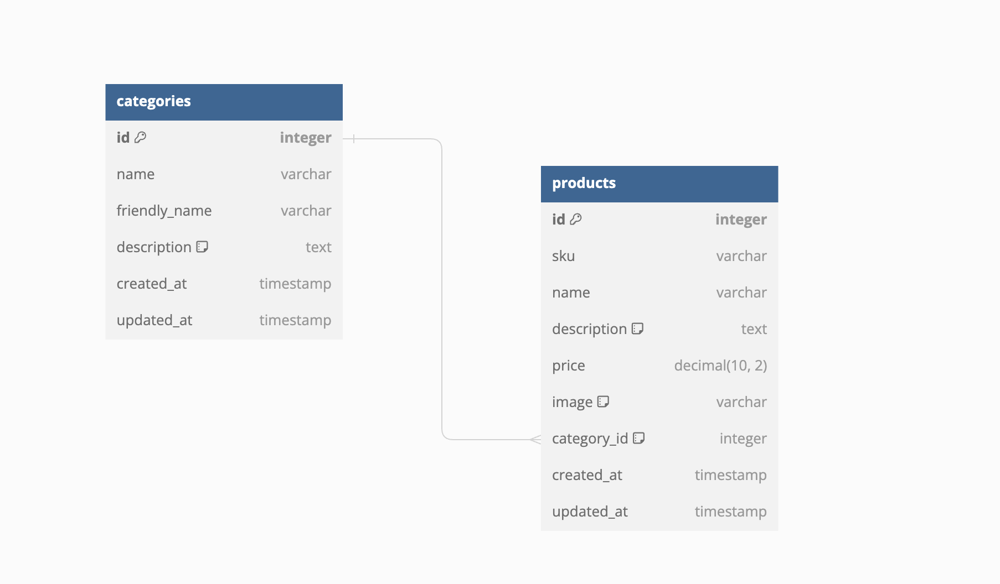

# Southville Sporting Club | Data Storing

## Bristol Based Vintage Athletic Wear
-------
[![VisitWebsite][website-shield]][website-url]&nbsp;&nbsp;
[![Issues][issues-shield]][issues-url]&nbsp;&nbsp;
[![ClosedIssues][closed-shield]][closed-url]&nbsp;&nbsp;
[![LinkedIn][linkedin-shield]][linkedin-url]

## Table of Contents 

# User Experience 

## Goals

### Business Goals
------
This website performs a twofold mission, finely honed to achieve tangible results: firstly, by meticulously crafting an effortlessly navigable e-commerce platform that seamlessly converts visitors into loyal customers. The user-friendly online store is fortified with secure transactions and showcases the captivating 'Run with Nature' collection - a harmonious blend of vintage athletics and natural elements that guarantees an immersive and satisfying shopping experience, ultimately translating clicks into sales. Secondly, the ambition is to cement an unmistakable identity as the icon of vintage athletic wear intertwined with nature's allure, forging an enduring connection with Bristol's scenic landscapes. 
Mission Statement: "Southville Sporting Club's mission is to unite vintage athletics, nature's beauty, and seamless e-commerce, crafting an active, nostalgic, and environmentally attuned lifestyle."

### User Stories 

| AS A/AN | I WANT TO BE ABLE TO… | SO I CAN… |
| --------------- | --------------- | --------------- |
| Viewing and Navigation |
| Shopper | View a list of items | See if any interest me to purchase |
| Shopper  | View product details | View further information such as images, descriptions, prices, and availability.
| Shopper | View the homepage  | See featured products and promotions |
| Registration/Accounts |
| Shopper | Register for an account | Track my purchases |
| Site User | Log in to my account securely | Access my profile and saved information |
| Site User | Reset my password | Recover access to my account |
| Site User | Login through social media | Easily login and set up an account |
| Site User | Update profile information | Ensure items are received and payments are correct |
| Sorting and Searching |
| Shopper | Filter products | View products by various criteria such as popularity, price, and newest arrivals |
| Shopper | Refine my search | Find specific items based on color or size |
| Shopper | Search for specific products using keywords | Quickly find what I'm looking for |
| Purchase and Checkout |
| Shopper | Add items to my shopping cart | Keep for a later purchase |
| Shopper | View my cart | See a summary of selected items and their quantities |
| Shopper | Update quantities or remove items | Purchase the goods I want |
| Shopper | Apply coupon codes | Save money on my order |
| Shopper | Choose from different payment options | Easily pay for my order |
| Shopper | Review order summary | Ensure the order is correct |
| Shopper | Receive a confirmation email | Confirm order details are correct and ensure the order was processed |
| Shopper | Apply coupon codes | Save money on my order |
| Site Owner |
| Site Owner | Manage and process orders | Send items to customers |
| Site Owner | Add and remove items from the site |  Show customers items that are in stock |

### Wireframes

### Schema

Initial product schema. 

<!-- MARKDOWN LINKS & IMAGES -->
[issues-shield]: https://img.shields.io/badge/ISSUES-2%20OPEN-yellow?style=for-the-badge&logo=closed
<!-- [issues-url]:  -->
[closed-shield]: https://img.shields.io/badge/CLOSED%20ISSUES-11%20CLOSED-blue?style=for-the-badge&logo=closed
<!-- [closed-url]:  -->
[linkedin-shield]: https://img.shields.io/badge/-LinkedIn-black.svg?style=for-the-badge&logo=linkedin&colorB=555
<!-- [linkedin-url]:  -->
[website-shield]: https://img.shields.io/badge/VISIT%20WEBSITE-HERE-green?style=for-the-badge&logo=closed
<!-- [website-url]:  -->

### Credit

Infinite Scrolling Banner
https://www.cssscript.com/responsive-text-scrolling-marquee/
Ordering footer col/row wise
https://codeburst.io/how-to-position-html-elements-side-by-side-with-css-e1fae72ddcc
Moving navbar dropdown items under the menu
https://stackoverflow.com/questions/51563809/materialize-css-navbar-menu-dropdown-wont-go-below-origin
Collapisble error on mobile 
https://stackoverflow.com/questions/53973266/materializecss-collapsibles-not-working-properly
Schema
https://dbdiagram.io/d
