

# Southville Sporting Club | Full Stack Website

## Bristol Based Vintage Athletic Wear

This website has been created to sell UK created athletic wear, it is based on a small UK concept business. 

[![VisitWebsite][website-shield]][website-url]&nbsp;&nbsp;
[![Issues][issues-shield]][issues-url]&nbsp;&nbsp;
[![ClosedIssues][closed-shield]][closed-url]&nbsp;&nbsp;
[![LinkedIn][linkedin-shield]][linkedin-url]
 

## **Table of Contents**

1. [User Experience](#user-experience)
2. [Design](#design)
3. [Features](#features)
4. [Accessibility](#accessibility)
5. [Technologies Used](#technologies-used)
6. [Deployment and Local Development](#deployment-and-local-development)
7. [Testing](#testing)
8. [Credits](#credits)
---
# User Experience

1. [Goals](#goals)
2. [Visual Design](#visual-design)

## Goals

1. [Business Goals](#business-goals)
2. [User Goals](#user-goals)
3. [Strategy](#strategy)

### Business Goals
------
This website performs a twofold mission, finely honed to achieve tangible results: firstly, by meticulously crafting an effortlessly navigable e-commerce platform that seamlessly converts visitors into loyal customers. The user-friendly online store is fortified with secure transactions and showcases the captivating 'Run with Nature' collection - a harmonious blend of vintage athletics and natural elements that guarantees an immersive and satisfying shopping experience, ultimately translating clicks into sales. Secondly, the ambition is to cement an unmistakable identity as the icon of vintage athletic wear intertwined with nature's allure, forging an enduring connection with Bristol's scenic landscapes. 
Mission Statement: "Southville Sporting Club's mission is to unite vintage athletics, nature's beauty, and seamless e-commerce, crafting an active, nostalgic, and environmentally attuned lifestyle."

### User Goals
------
Prospective users of this website seek a seamless and enjoyable online shopping experience where they can explore and purchase the captivating 'Run with Nature' collection. They aim to find high-quality vintage athletic wear that reflects their active lifestyle and appreciation for eco-friendly materials, all while connecting with the vibrant spirit of Bristol's scenic landscapes. Additionally, users intend to make secure and hassle-free transactions, converting their interest into a satisfying shopping journey.
### Strategy
------
The primary target audience for Southville Sporting Club is individuals aged 20-40 who seek stylish and sustainable unisex clothing that resonates with the spirit of vintage athletics and nature's beauty.

What the users would be looking for:
* Effortless Navigation: Users expect a user-friendly and intuitive interface that allows them to easily explore the website and find products.
* Account Creation: Users should be able to create a personal account for a customised shopping experience, including saving preferences and order history.
* Product Information: Comprehensive product descriptions, high-quality images, and sizing information to help users make informed choices.
* Security: Users want to feel confident that their personal and financial information is secure when making purchases.
* Sustainability Information: Details about the use of eco-friendly materials, reinforcing the brand's commitment to sustainability.
* Contact and Support: Access to customer support or contact information for inquiries and assistance.

[Back to top](#table-of-contents)

## Visual Design

### Fonts 
------
I used Google fonts 'Helvetica' and 'Times New Roman'. I used the Times New Roman font to make the header text on the index page stand out from the regular font on the site. I then used 'Helvetica' as I thought it was very easy to read and looks professional.

### Styling 
------
* Materialize CSS files have been incorporated into the project to leverage its pre-defined class defaults and components.
* The class defaults of Materialize CSS have been overridden to align with the desired styling preferences.
* Customisation has been made easier by modifying the source files directly, allowing for a consistent and unified design.
* The website incorporates responsive web design, allowing the site to adjust dynamically based on the screen size.
* Links present on each page have been intelligently designed to redirect users to essential sections, such as the Client or the Register page, irrespective of their current location.

### Wireframes
------

Index

Desktop

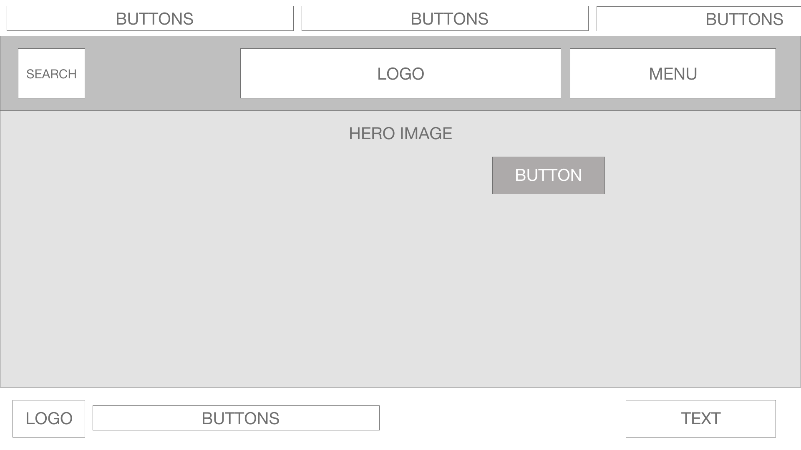
<!-- for when you're on AWS!! (static/images/readme/wireframes/index-desktop.png) -->

Mobile

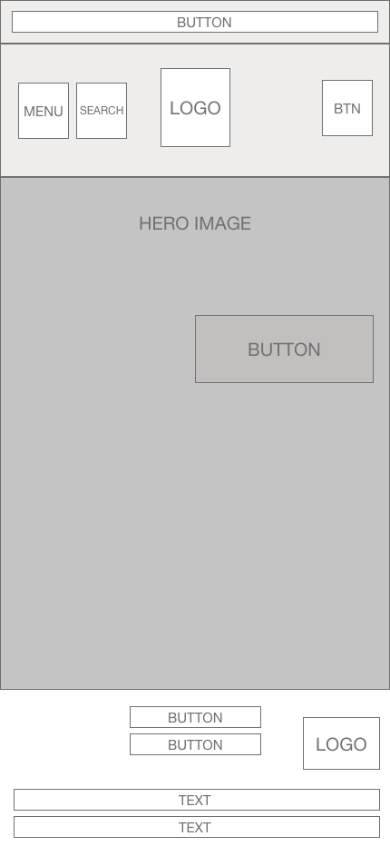

 

Products

Desktop

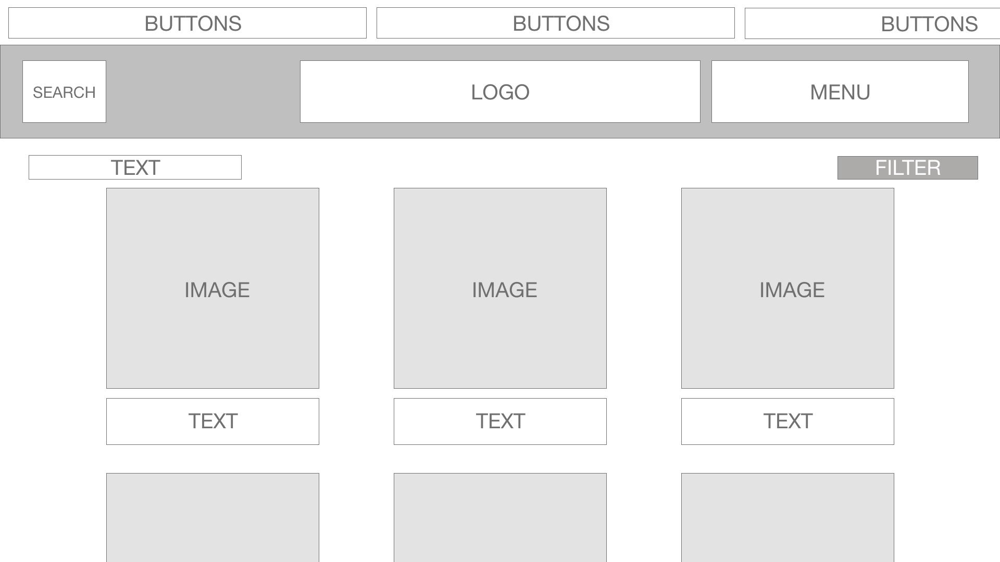
<!-- for when you're on AWS!! (static/images/readme/wireframes/index-desktop.png) -->

Mobile

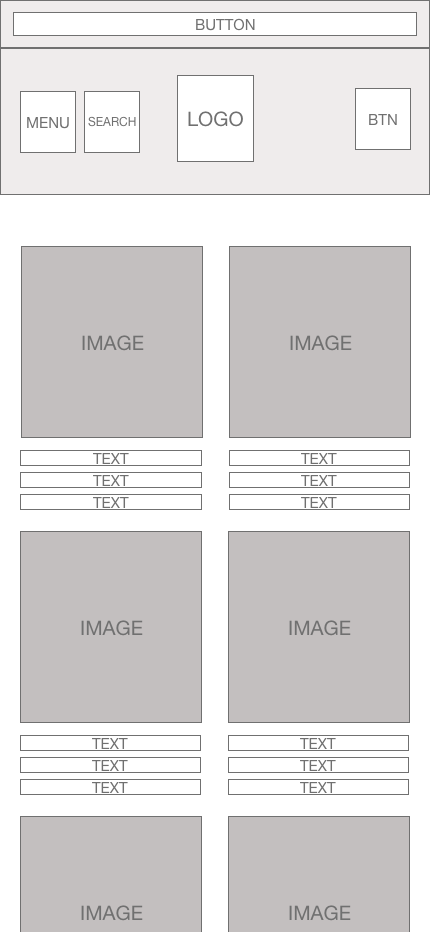

 

Product Detail

Desktop

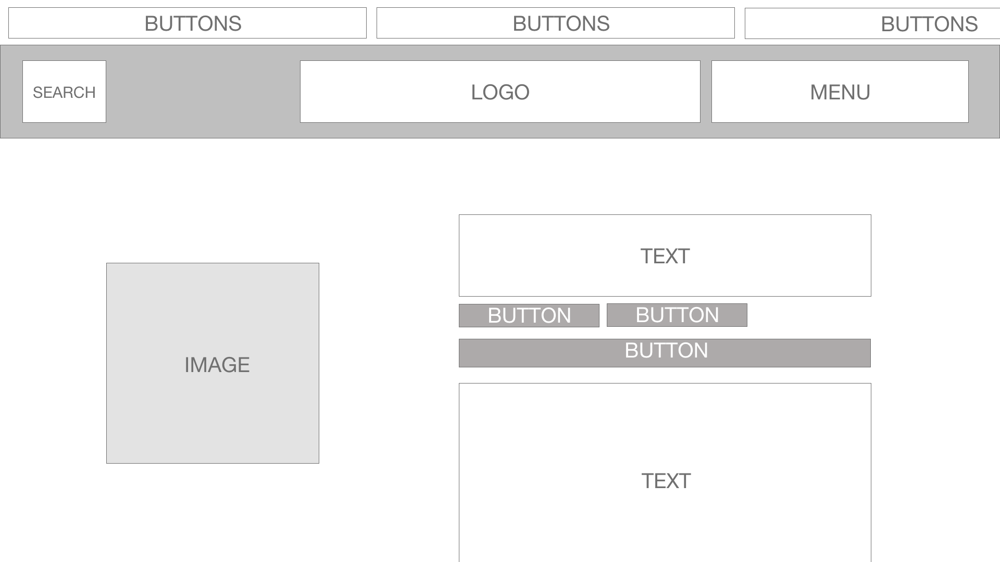
<!-- for when you're on AWS!! (static/images/readme/wireframes/index-desktop.png) -->

Mobile

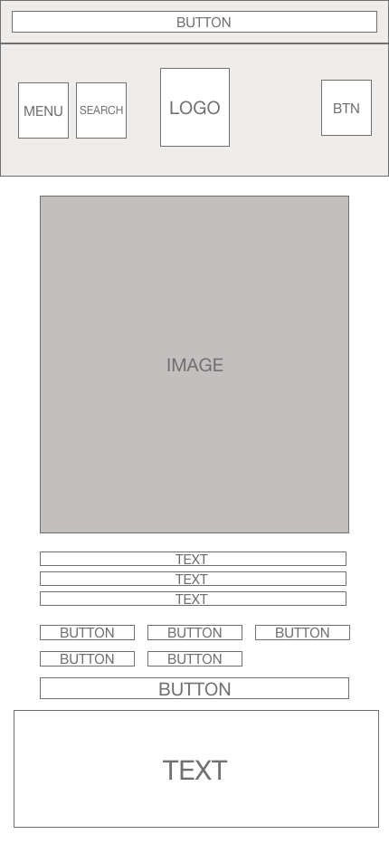

 

Bag

Desktop

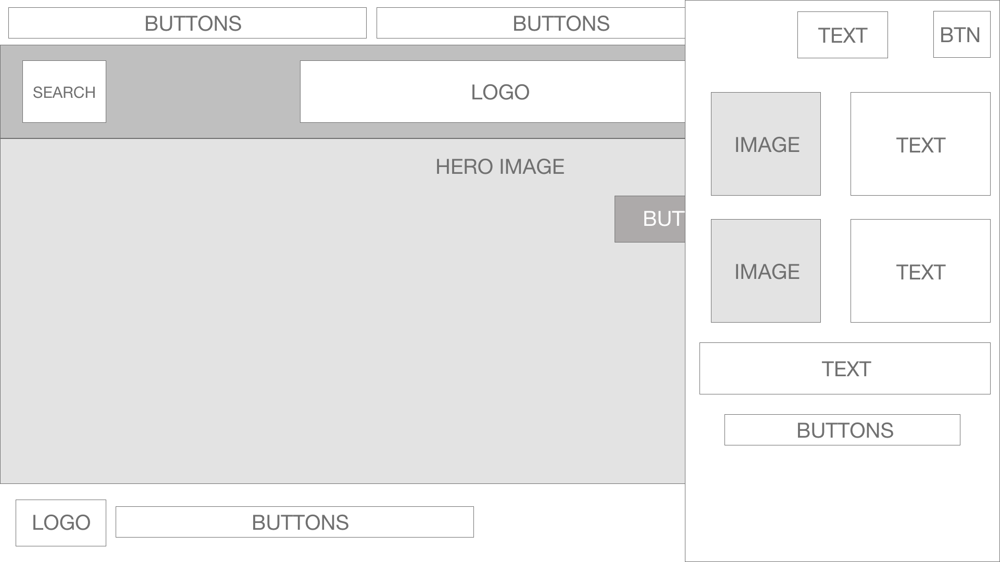
<!-- for when you're on AWS!! (static/images/readme/wireframes/index-desktop.png) -->

Mobile

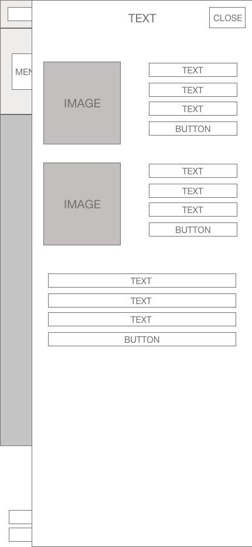

 

Checkout

Desktop

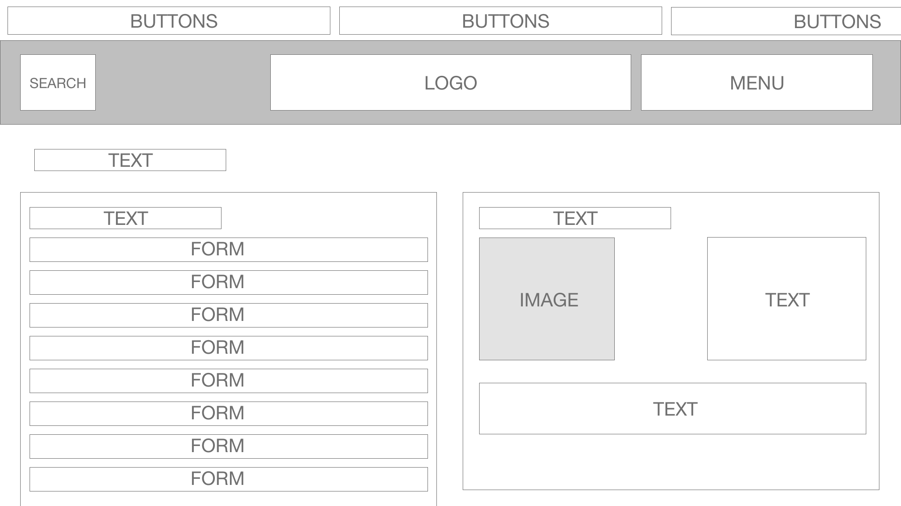
<!-- for when you're on AWS!! (static/images/readme/wireframes/index-desktop.png) -->

Mobile

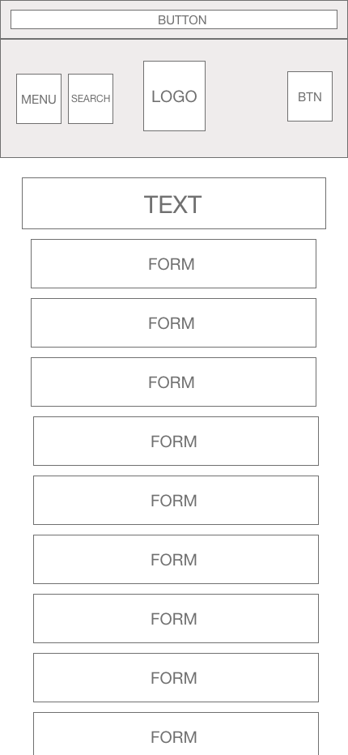

 

Profile

Desktop

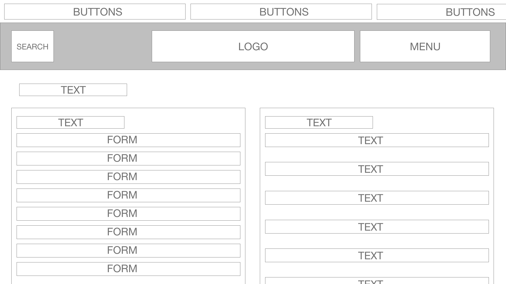
<!-- for when you're on AWS!! (static/images/readme/wireframes/index-desktop.png) -->

Mobile

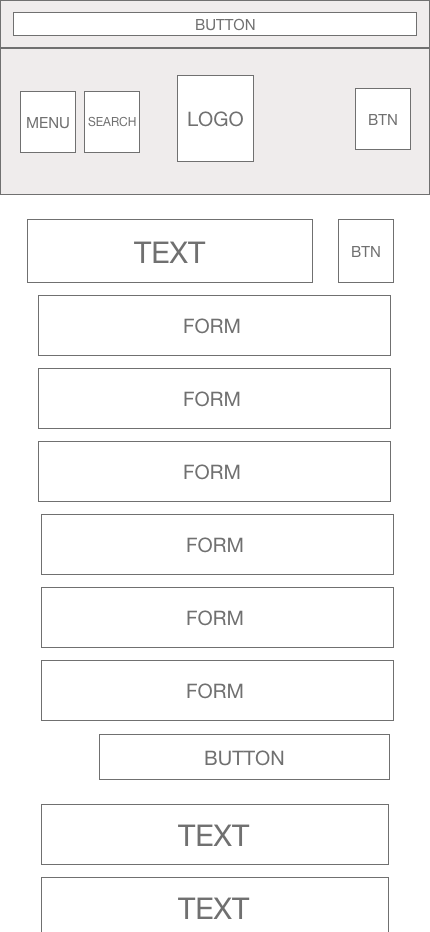

 

Contact

Desktop

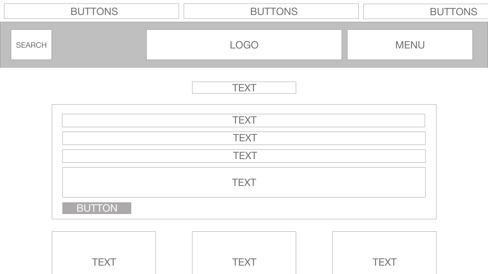
<!-- for when you're on AWS!! (static/images/readme/wireframes/index-desktop.png) -->

Mobile

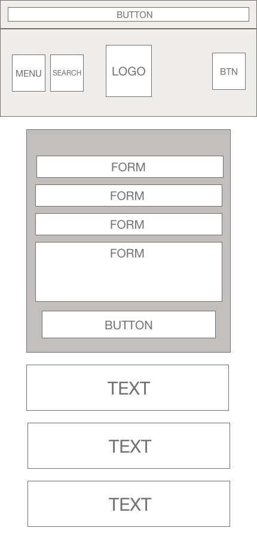

 

Admin Dashboard

Desktop

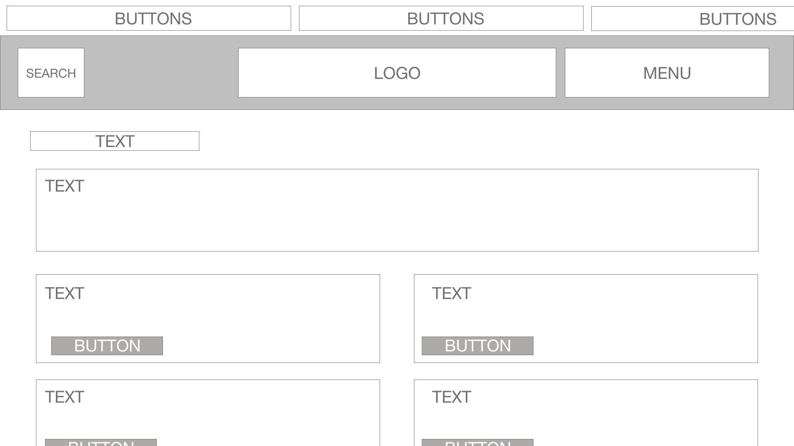
<!-- for when you're on AWS!! (static/images/readme/wireframes/index-desktop.png) -->

Mobile

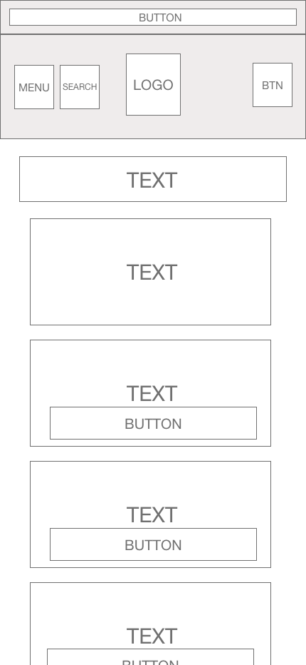

 

Shipping & Terms

Desktop

<!-- for when you're on AWS!! (static/images/readme/wireframes/index-desktop.png) -->

Mobile

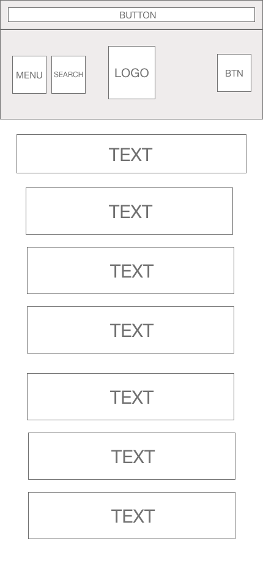

 

### Database Schema
------

### User Stories 

| AS A/AN | I WANT TO BE ABLE TO… | SO I CAN… |
| --------------- | --------------- | --------------- |
| Viewing and Navigation |
| Shopper | View a list of items | See if any interest me to purchase |
| Shopper  | View product details | View further information such as images, descriptions, prices, and availability.
| Shopper | View the homepage  | See featured products and promotions |
| Registration/Accounts |
| Shopper | Register for an account | Track my purchases |
| Site User | Log in to my account securely | Access my profile and saved information |
| Site User | Reset my password | Recover access to my account |
| Site User | Login through social media | Easily login and set up an account |
| Site User | Update profile information | Ensure items are received and payments are correct |
| Sorting and Searching |
| Shopper | Filter products | View products by various criteria such as popularity, price, and newest arrivals |
| Shopper | Refine my search | Find specific items based on color or size |
| Shopper | Search for specific products using keywords | Quickly find what I'm looking for |
| Purchase and Checkout |
| Shopper | Add items to my shopping cart | Keep for a later purchase |
| Shopper | View my cart | See a summary of selected items and their quantities |
| Shopper | Update quantities or remove items | Purchase the goods I want |
| Shopper | Apply coupon codes | Save money on my order |
| Shopper | Choose from different payment options | Easily pay for my order |
| Shopper | Review order summary | Ensure the order is correct |
| Shopper | Receive a confirmation email | Confirm order details are correct and ensure the order was processed |
| Shopper | Apply coupon codes | Save money on my order |
| Site Owner |
| Site Owner | Manage and process orders | Send items to customers |
| Site Owner | Add and remove items from the site |  Show customers items that are in stock |

### Wireframes

### Schema

Initial product schema. 

<!-- MARKDOWN LINKS & IMAGES -->
<!-- [issues-shield]:  -->
[issues-shield]: https://img.shields.io/badge/ISSUES-2%20OPEN-yellow?style=for-the-badge&logo=closed
<!--- [issues-url] -->
[issues-url]:https://github.com/nccadman19/southville-sporting-club/issues
<!-- [closed-shield]:  -->
[closed-shield]: https://img.shields.io/badge/CLOSED%20ISSUES-11%20CLOSED-blue?style=for-the-badge&logo=closed
<!-- [closed-url]:  -->
[closed-url]: https://github.com/nccadman19/southville-sporting-club/issues?q=is%3Aissue+is%3Aclosed
<!-- [linkedin-shield]:  -->
[linkedin-shield]: https://img.shields.io/badge/-LinkedIn-black.svg?style=for-the-badge&logo=linkedin&colorB=555
<!-- [linkedin-url]:  -->
[linkedin-url]: https://www.linkedin.com/in/nicoleccadman/
<!-- [website-shield]:  -->
[website-shield]: https://img.shields.io/badge/VISIT%20WEBSITE-HERE-green?style=for-the-badge&logo=closed
<!-- [website-url]:  -->
[website-url]: https://southville-sporting-club-ed7d11c9dd6e.herokuapp.com/

### Credit

Infinite Scrolling Banner
https://www.cssscript.com/responsive-text-scrolling-marquee/
Ordering footer col/row wise
https://codeburst.io/how-to-position-html-elements-side-by-side-with-css-e1fae72ddcc
Moving navbar dropdown items under the menu
https://stackoverflow.com/questions/51563809/materialize-css-navbar-menu-dropdown-wont-go-below-origin
Collapisble error on mobile 
https://stackoverflow.com/questions/53973266/materializecss-collapsibles-not-working-properly
Schema
https://dbdiagram.io/d
Products, Categories, Showing products on website
https://www.youtube.com/watch?v=obZMr9URmVI&list=PL-51WBLyFTg0omnamUjL1TCVov7yDTRng&index=2
Zoom on hover
https://www.w3schools.com/howto/howto_css_zoom_hover.asp
Collapsible product details page
https://materializecss.com/collapsible.html
center col in materialize 
https://stackoverflow.com/questions/38492194/centering-a-col-card-panel-in-materialize
cards on t&cs
https://stackoverflow.com/questions/41040506/materialize-scroll-tbody
adding multiple categories
https://www.sankalpjonna.com/learn-django/the-right-way-to-use-a-manytomanyfield-in-django
search function synonyms 
https://www.holisticseo.digital/python-seo/nltk/wordnet
button styling
https://stackoverflow.com/questions/59607164/adjust-width-of-multiple-buttons-to-follow-the-button-with-the-largest-wrap-cont
cart error help
https://stackoverflow.com/questions/63675859/attribute-error-int-object-has-no-attribute-get
remove button
https://stackoverflow.com/questions/72875203/remove-item-from-cart-and-manage-quantity-buttons-not-working-when-i-add-mor
address api
https://pypi.org/project/geopy/
dialogs
https://www.tutorialspoint.com/materialize/materialize_dialogs.html
country selector
https://stackoverflow.com/questions/2963930/django-country-drop-down-list
stripe
https://www.youtube.com/watch?v=722A27IoQnk&t=776s
stripe2
https://dev.to/documatic/integrate-stripe-payments-with-django-by-building-a-digital-products-selling-app-le5
stripe3
https://stripe.com/docs/checkout/quickstart
buttons
https://stackoverflow.com/questions/64232515/css-on-clickable-element-onclickhover
modal for delete buttons
https://materializecss.com/modals.html#!
detecting ctrl click
https://stackoverflow.com/questions/16190455/how-to-detect-controlclick-in-javascript-from-an-onclick-div-attribute
checkboxes
https://materializecss.com/checkboxes.html
fixing selected options
https://stackoverflow.com/questions/46415457/jquery-onclick-change-option-selected-attribute
slack thread 
- fixed the issue i was having with the webhook!!!!
getting quantity to show correctly 
https://www.quora.com/How-do-I-fix-AttributeError-int-object-has-no-attribute-get-in-Python
timezone help
https://stackoverflow.com/questions/18622007/runtimewarning-datetimefield-received-a-naive-datetime
favicon error
https://stackoverflow.com/questions/1321878/how-to-prevent-favicon-ico-requests

bugs
cannot get the cart popup to disappear when user clicks away from the display
xl being checked in edit product as its inside XXL 
