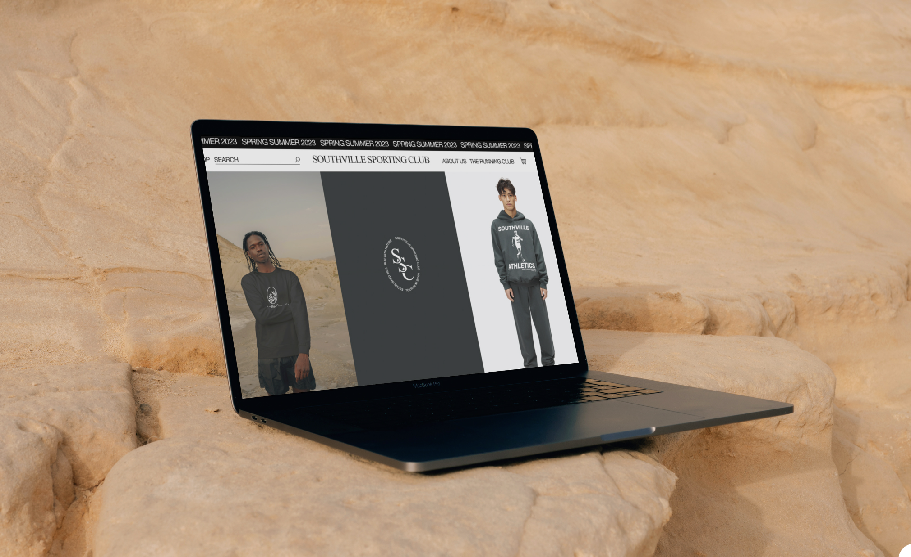

# Southville Sporting Club | Data Storing

## Bristol Based Vintage Athletic Wear
-------
[![VisitWebsite][website-shield]][website-url]&nbsp;&nbsp;
[![Issues][issues-shield]][issues-url]&nbsp;&nbsp;
[![ClosedIssues][closed-shield]][closed-url]&nbsp;&nbsp;
[![LinkedIn][linkedin-shield]][linkedin-url]

## Table of Contents 

# User Experience 

## Goals

### Business Goals
------
This website performs a twofold mission, finely honed to achieve tangible results: firstly, by meticulously crafting an effortlessly navigable e-commerce platform that seamlessly converts visitors into loyal customers. The user-friendly online store is fortified with secure transactions and showcases the captivating 'Run with Nature' collection - a harmonious blend of vintage athletics and natural elements that guarantees an immersive and satisfying shopping experience, ultimately translating clicks into sales. Secondly, the ambition is to cement an unmistakable identity as the icon of vintage athletic wear intertwined with nature's allure, forging an enduring connection with Bristol's scenic landscapes. 
Mission Statement: "Southville Sporting Club's mission is to unite vintage athletics, nature's beauty, and seamless e-commerce, crafting an active, nostalgic, and environmentally attuned lifestyle."

### Wireframes

<!-- MARKDOWN LINKS & IMAGES -->
[issues-shield]: https://img.shields.io/badge/ISSUES-2%20OPEN-yellow?style=for-the-badge&logo=closed
<!-- [issues-url]:  -->
[closed-shield]: https://img.shields.io/badge/CLOSED%20ISSUES-11%20CLOSED-blue?style=for-the-badge&logo=closed
<!-- [closed-url]:  -->
[linkedin-shield]: https://img.shields.io/badge/-LinkedIn-black.svg?style=for-the-badge&logo=linkedin&colorB=555
<!-- [linkedin-url]:  -->
[website-shield]: https://img.shields.io/badge/VISIT%20WEBSITE-HERE-green?style=for-the-badge&logo=closed
<!-- [website-url]:  -->
